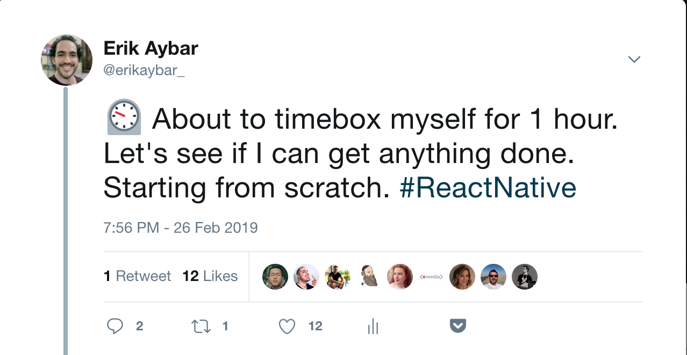
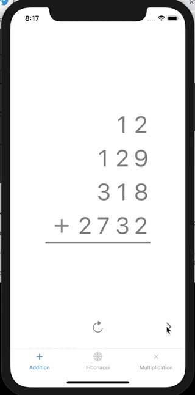
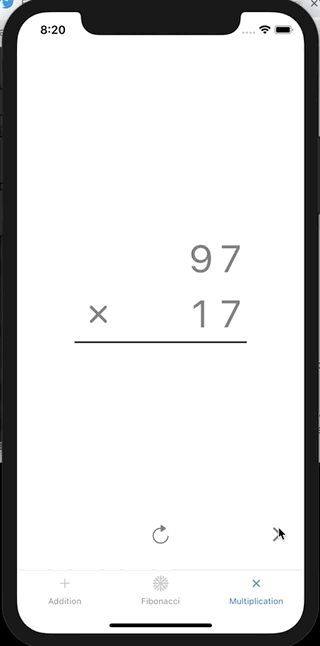
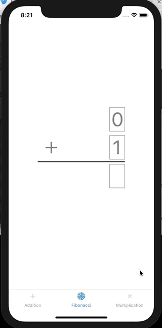

# Math Explorer

A visual approach to learning math for kids!

## About this Project

🚧 This project is in its early stages.

This project began as an experiment for me to experiment with [Expo](https://expo.io/) and to explore this idea I had been toying around with building. For a look into the process and progress, see this long-running [Twitter thread])(https://twitter.com/erikaybar_/status/1100590568273600512).

## Preview of Current State

### Addition

### Multiplication

### Fibonacci

---

TODO: Make this README more useful 😀
